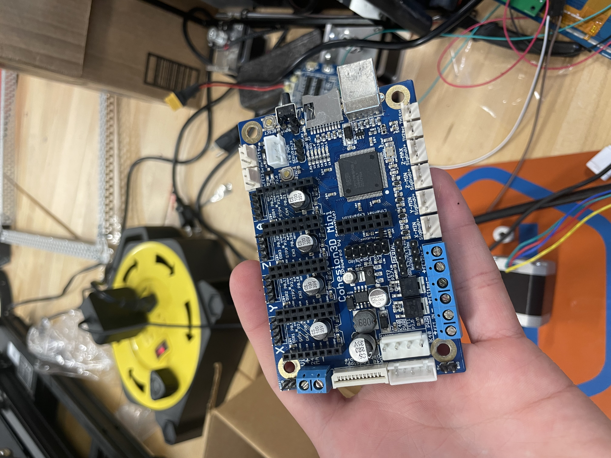
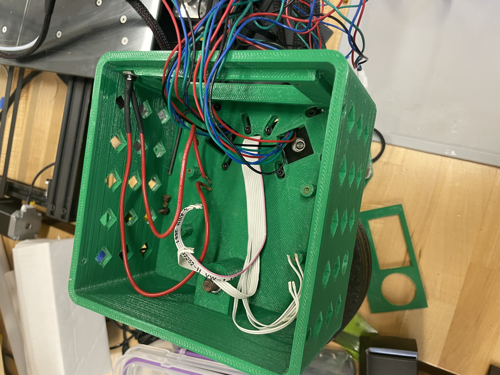
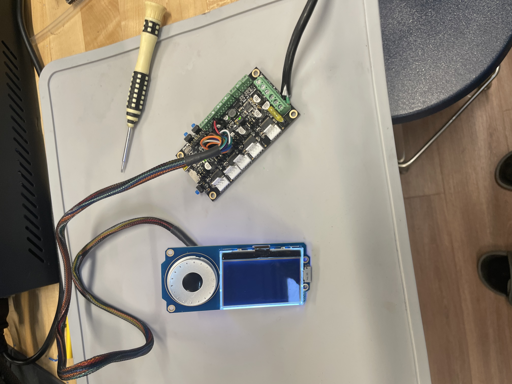

I wired this motherbord in the hopes of being able to just turn on a working motherboard instead of flashing firmware

I used this wiring guide to plug in the board
https://www.google.com/url?sa=i&url=https%3A%2F%2Fforum.cohesion3d.com%2Ft%2Fdetailed-board-layout-pinout%2F1401&psig=AOvVaw374_L85YiJ5dEqBz1u6khi&ust=1696599439410000&source=images&cd=vfe&opi=89978449&ved=0CBAQjRxqFwoTCLiIicmD34EDFQAAAAAdAAAAABAE

I removed the motherboard from the other printer to start work on and plug in the board 

I used this wiring guide to wire it up but the screen does not work so I will need to flash the firmware
http://files.panucatt.com/datasheets/x3_wiring_diagram.pdf

